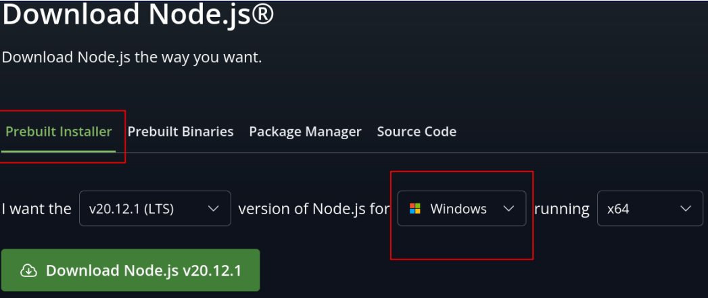
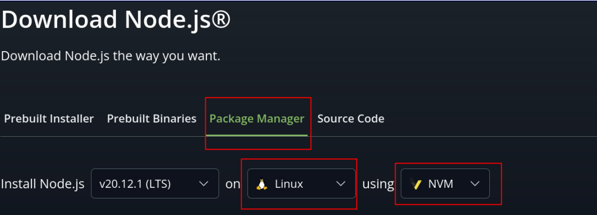

# UTN-BA---Second-quarter---Programming-II---POO-Exercises
Public repository, designed to maintain the profile's activity frequency, upload exercises, and update solutions with more efficient algorithms.

This repository was created for personal and academic use, and with the purpose of study object-oriented programming. However, if you would like to suggest improvements or comment solutions, feel free to open an [issue](https://github.com/facundovarela99/UTN-BA---Second-quarter---Programming-II---POO-Exercises/issues)!

Technologies used: TypeScript, Node.js, Visual Studio Code

# Configuración del entorno de desarrollo para Laboratorio 3

Vamos a comentar 2 alternativas, una utilizando Docker y otra instalando todos los componentes necesarios sobre la máquina host.


# Instalando todo sobre la máquina host

## Instalar NodeJs

1. Ingresar a [NodeJs - Descargas](https://nodejs.org/en/download/) y seleccionar según la plataforma en la que nos encontremos el instalador que mejor se adapte a nuestro sistema operativo.

👉 En el caso de Windows, seleccionar los instaladores que se encuentran en la pestaña "Prebuilt Installer"



👉 En el caso de MacOs o Linux, seleccionar la pestaña "Package Manager" y seleccionar "NVM" en el último combo. Luego copiar y ejecutar en una terminal los comandos que se muestran.



⚠️ **En todos los casos seleccionar alguna versión estable (LTS)**


## Directorio de trabajo

Una vez instalado node, debemos crear el directorio en el cual vamos a desarrollar.
Crear un directorio, que será el directorio del proyecto a utilizar y dentro del mismo descomprimir el archivo 📦 *bootstrap.zip*.

Este archivo contiene lo siguiente:

📂/
 - 📂 src: directorio donde crearemos todos los archivos typescript (\*.ts)
  - 📄 index.ts: archivo de prueba. A futuro será nuestro punto de entrada.
 - 📂 tests: directorio donde crearemos las pruebas unitarias 
 - 📄 package.json: este archivo contiene los comandos a utilizar en el desarrollo y los paquetes necesarios para construir nuestra solución.
 - 📄 tsconfig.json: este archivo contiene la configuración utilizada en el proceso de "compilación"
 - 📄 jest.config.js: este archivo contiene la configuración utilizada durante la ejecución de las pruebas unitarias.
 - 📄 README.md: este archivo.


## Instalar las dependencias

Desde una terminal, ingresar al directorio de trabajo creado y ejecutar el siguiente comando: 

```bash
# comando que permite instalar los paquetes especificados en el archivo package.json
user@host:~$ npm i
```

## Compilar el proyecto

Desde una terminal, ingresar al directorio de trabajo creado y ejecutar el siguiente comando: 

```bash
# comando que permite compilar la solución.
user@host:~$ npm run build
```

## Configurar VisualCode (IDE)

Instalar los siguientes complementos:

* [ESLint](https://marketplace.visualstudio.com/items?itemName=dbaeumer.vscode-eslint).
* [JEST](https://marketplace.visualstudio.com/items?itemName=Orta.vscode-jest)
* [PlantUML](https://marketplace.visualstudio.com/items?itemName=jebbs.plantuml)
